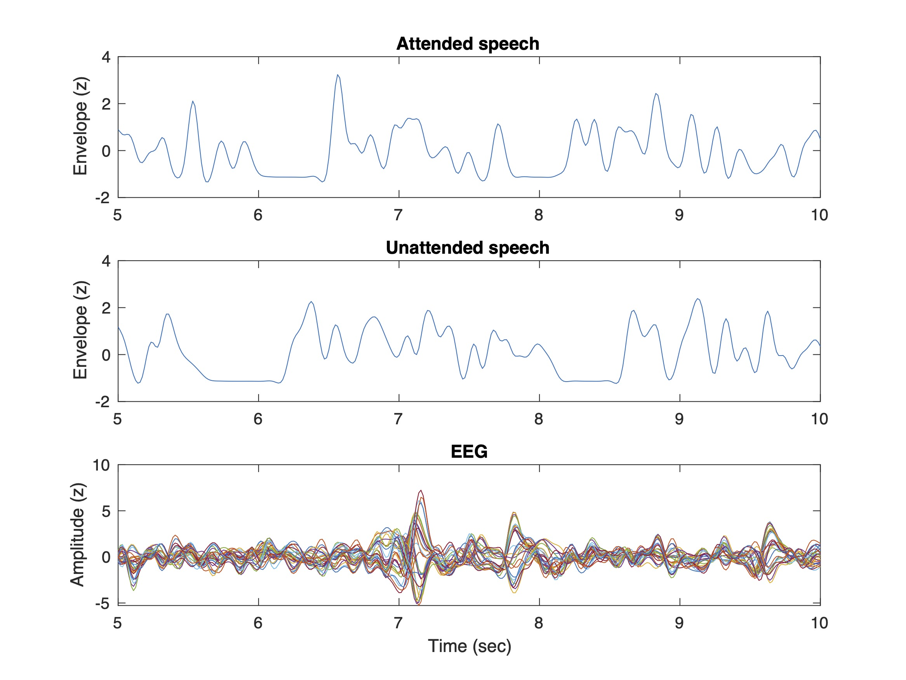

# Publication
Park, J. J., Baek, S. C., Suh, M. W., Choi, J., Kim, S. J., & Lim, Y. (2023). The effect of topic familiarity and volatility of auditory scene on selective auditory attention. Hearing Research, 108770.
https://doi.org/10.1016/j.heares.2023.108770

# Dataset

Download link: https://drive.google.com/drive/folders/10QCMWuknyyW7hiR7onKSNbaaelMbvRLp?usp=share_link

# EEG Data

"DATA(3conditions)_rev210330.mat" contains EEG, stimuli(SPEECH), paradigm protocols(INDEX) and behavioral response(INDEX).   
There are three experiment conditions i.e. {1: baseline condition(Easy-level), 2: Top-down complex condition(High-level), 3:Volatile condition}. 
You can refer data of the condition with the index number(1~3).   

- EEG: 30 trials * 60 channels * 3840 samples (3840 = 60 sec * 64 samples/sec).    
- INDEX: paradigm protocols (what stimulus the participant attended or unattended) & behavioral data(to test comprehsnsion level, four quizzes are presended (two for attended & two for unattended speech) for each trial).    
- SPEECH: Envelope of speech stimuli.  

# Sound file
Folder named as "Speech stimuli(sound files)" contains sound files of SPEECH data (before extract envelope).  
- 60 stimuli for three conditions (total 180 sound files with 60 sec of duration).  

*Total number of participants = 30.  
- 10 participants for each 3 different condition (there is no double-participated subject)

# Dataset structure
DATA(1*3)   
- EEG(1*10)(participants)   
  - data (30 * 60 * 3840) (trials * channels*samples(= 60 sec * 64 samples(i.e. sample rate: 64Hz)))   
  - fs (sample rate of the EEG = 64 Hz)   
  - duration (60 sec)(duration of the EEG)   
  - id (id of each participant)   
  - chanlocs (60 channels)(channel location info, EEGLAB format)   
- INDEX(1*10)(participants)
  - id (id of each participant)    
  - a (index of attended speech stimuli, corresponding to each "SPEECH" of the participant)    
  - u (index of unattended speech stimuli)     
  - left_is_1 (1: the participant attended to the left ear in this trial, 0: attended to the right ear)      
  - a_correctness (1:correctly answered, 0:wrongly answered) (correctness of the comprehsnsion quizzes for the attended speech)      
  - a_rt (response time in seconds)(response time of comprehsnsion quiz for the attended speech)      
  - u_correctness (that of unattended speech)      
  - u_rt (that of unattended speech)     
- SPEECH (60 * 3840) (60 stimuli * 3840 samples (= 60 sec * 64 samples (i.e. sample rate: 64Hz)))      
- Label (=name of each condition)       

# Usage example of how to recall the data
1. When you want to recall "EEG data of fourth trial(with whole channels and whole durations) of 7th participant in third condition(Volatile condition)",  
>> DATA(3).EEG(7).data(4,:,:)
% then the output will come out as "1*60*3840 single")

2. When you want to recall "SPEECH stimuli(envelope) that the participant(=7th participant in the third condition(Volatile)) has attended while the fourth trial",   
>> DATA(3).SPEECH( DATA(3).INDEX(7).a(4), :)
% then the output will come out as "1*3840 double")

# Example code

Run example.m and you will be able to get the figure as below

